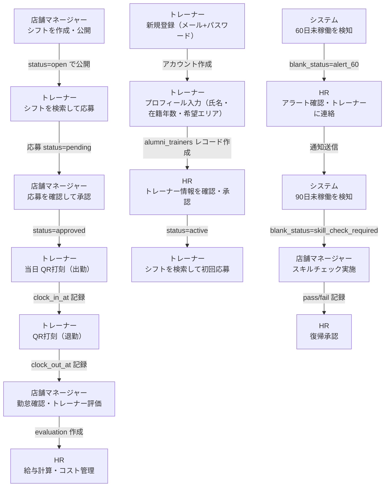

# Dr.stretch SPOT

退職トレーナー向けスポットバイトマッチングプラットフォーム

## 概要

Dr.ストレッチを退職した認定トレーナー（OB/OG）が、好きな時間に好きな店舗で副業できるマッチングシステムです。

- **トレーナー**: シフト検索・応募・QR打刻・収入管理
- **店舗マネージャー**: シフト作成・応募管理・勤怠管理・評価
- **HR（人事部）**: 全体管理・時給設定・直接オファー・退職処理
- **管理者**: システム全体管理

## 技術スタック

| レイヤー | 技術 |
|---------|------|
| フレームワーク | Next.js 16 (App Router, Turbopack) |
| UI | shadcn/ui + Tailwind CSS v4 |
| データベース | Supabase (PostgreSQL + Auth + RLS) |
| ホスティング | Vercel |
| LINE Bot | LINE Messaging API + @line/bot-sdk |
| メール | Resend API |
| 言語 | TypeScript (strict) |

## ロール別ログインURL

各ロール専用の独立したログインページがあります。URLを知っている人だけがアクセスできます。

| ロール | ログインURL | 主な機能 |
|--------|-----------|---------|
| **トレーナー**（スポットバイト） | https://dr-stretch-spot.vercel.app/login | シフト検索・応募・QR打刻・収入確認 |
| **店舗マネージャー** | https://dr-stretch-spot.vercel.app/login/store | シフト作成・応募管理・勤怠管理・評価 |
| **人事（HR）** | https://dr-stretch-spot.vercel.app/login/hr | 全店横断管理・時給設定・コスト管理・承認 |
| **管理者（Admin）** | https://dr-stretch-spot.vercel.app/login/admin | KPI・コスト分析・全権限 |

> 自己登録は無効化されています。アカウントはAdmin画面から作成してください。

## セットアップ

```bash
# インストール
npm install

# 環境変数を設定
cp .env.example .env.local
# → .env.local を編集

# 開発サーバー起動
npm run dev
```

## 環境変数

`.env.local` に以下を設定：

```env
NEXT_PUBLIC_SUPABASE_URL=
NEXT_PUBLIC_SUPABASE_ANON_KEY=
SUPABASE_SERVICE_ROLE_KEY=
LINE_CHANNEL_SECRET=
LINE_CHANNEL_ACCESS_TOKEN=
RESEND_API_KEY=
NEXT_PUBLIC_APP_URL=
```

## ドキュメント

| ドキュメント | 内容 |
|------------|------|
| [docs/specification.md](docs/specification.md) | プロジェクト企画書・全仕様書 |
| [docs/handoff-notes.md](docs/handoff-notes.md) | エンジニア引き継ぎノート（ローンチ前改善内容・セットアップ・チェックリスト） |
| [docs/test-guide.md](docs/test-guide.md) | テスト手順書 |
| [docs/trainer-registration-flow.md](docs/trainer-registration-flow.md) | トレーナー登録フロー設計書 |
| [SPEC.md](SPEC.md) | システム仕様書（技術詳細） |
| [flow-diagram.json](flow-diagram.json) | 画面遷移図（JSON） |

## ディレクトリ構造

```
src/
├── app/
│   ├── (auth)/       # ログイン・登録
│   ├── (trainer)/    # トレーナー向け画面（モバイルファースト）
│   ├── (store)/      # 店舗マネージャー向け画面
│   ├── (hr)/         # HR向け画面
│   ├── (admin)/      # 管理者向け画面
│   └── api/          # APIエンドポイント
├── actions/          # Server Actions（17ファイル）
├── components/
│   ├── shared/       # 共有コンポーネント（Header, BottomNav, StaffLoginForm等）
│   └── ui/           # shadcn/uiコンポーネント
├── lib/              # ユーティリティ
└── types/            # TypeScript型定義
```

## コマンド

```bash
npm run dev      # 開発サーバー
npm run build    # ビルド
npm run lint     # Lint
npm run start    # 本番サーバー
```

## フロー図

> 自動生成: 2026/3/19 | ソース: `flow-diagram.json`


